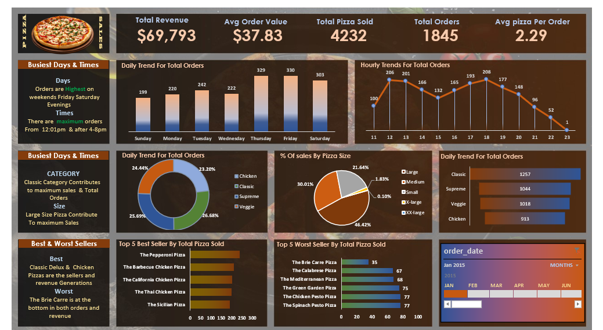

# 📊 SQL + Excel Data Analysis Project

## 🔍 Overview
This project focuses on analyzing [Pizza_ Sales] using SQL and Excel to extract meaningful insights.

## 🛠 Tools Used
- SQL (MySQL / PostgreSQL)
- Microsoft Excel

## 📂 Dataset
- Source: [Dataset](pizza_sales(1).csv)
- Format: Excel (.xlsx)

## 📈 Key Insights
- Insight 1:Peak Sales Timing
“Sales are highest during evenings and weekends, indicating strong demand during leisure hours.”
Meaning:
Customers order more when they are free (dinner time / weekends)
Business Impact:
Increase staffing during peak hours
Offer evening combo deals

- Insight 2:Insight 2: Top-Selling Pizza Categories
“Classic and Chicken pizzas contribute the highest revenue compared to other categories.”
Meaning:
Customers prefer familiar and protein-rich options
Business Impact:
Focus marketing on best-selling categories
Introduce variations of popular pizzas

- Insight 3:High Revenue from Few Items (Pareto Insight)
“A small number of pizza types generate a large portion of total revenue.”
This follows the Pareto Principle
Meaning:
Not all menu items are equally important
Business Impact:
Promote top-performing pizzas
Remove or redesign low-selling items

## 🧠 SQL Concepts Used
- Joins
- Group By
- Aggregate Functions
- Subqueries

## 📊 Excel Features Used
- Pivot Tables
- Charts
- Data Cleaning

## 📸 Dashboard Preview

## 🚀 How to Use
1. Download dataset
2. Run SQL queries
3. Open Excel dashboard 
